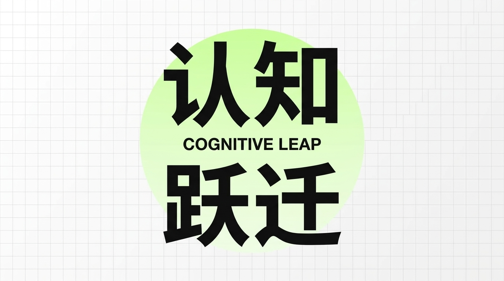
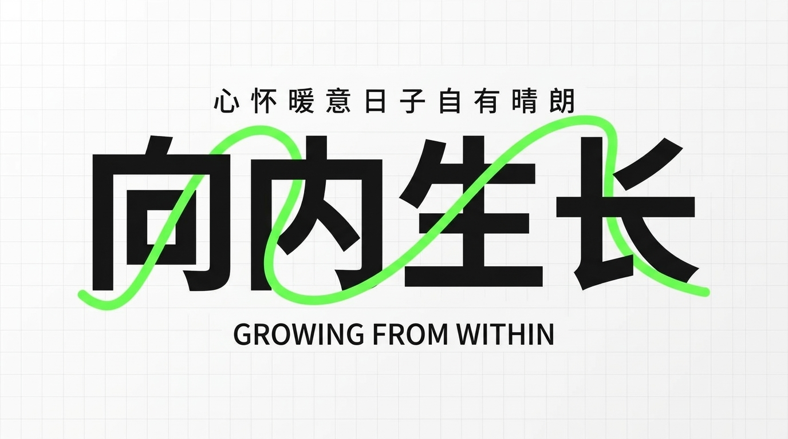
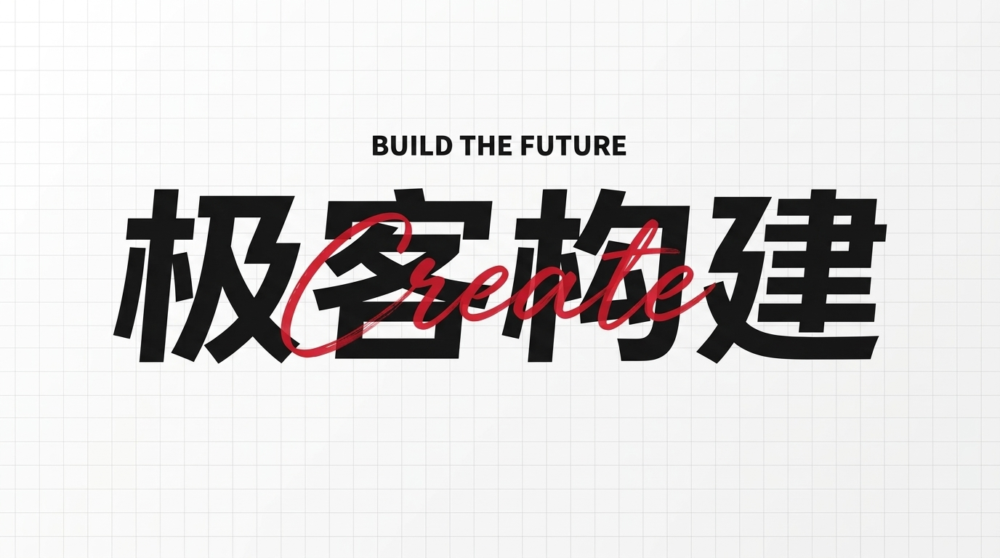
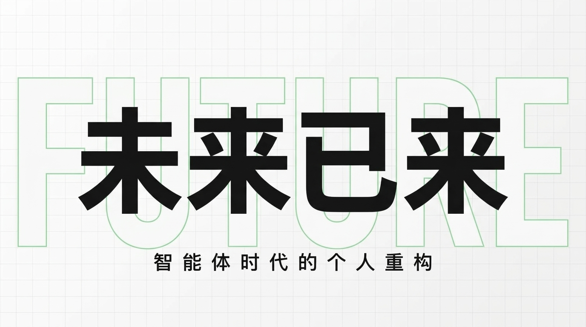
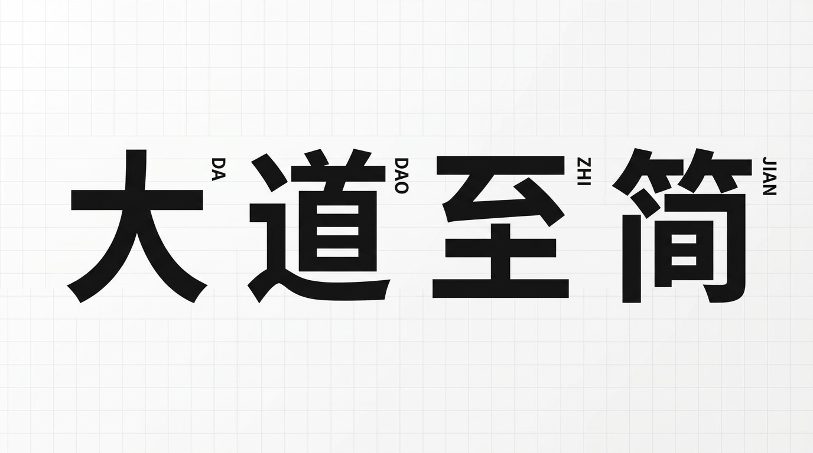
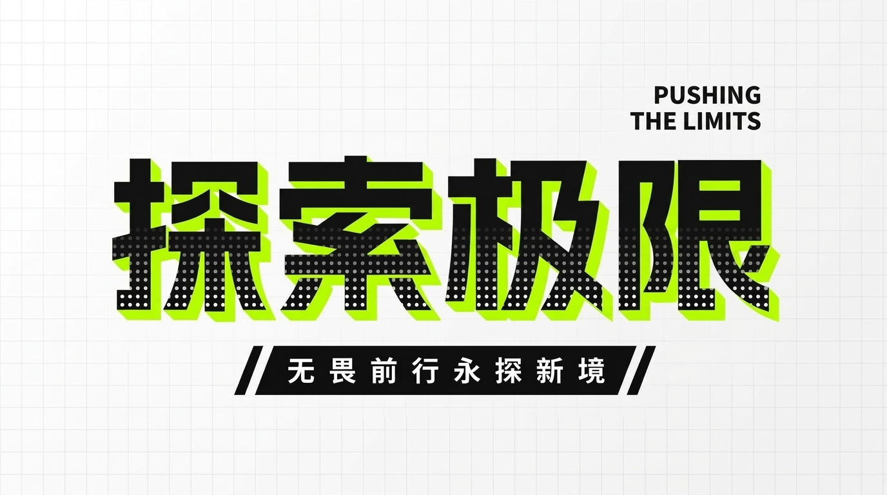
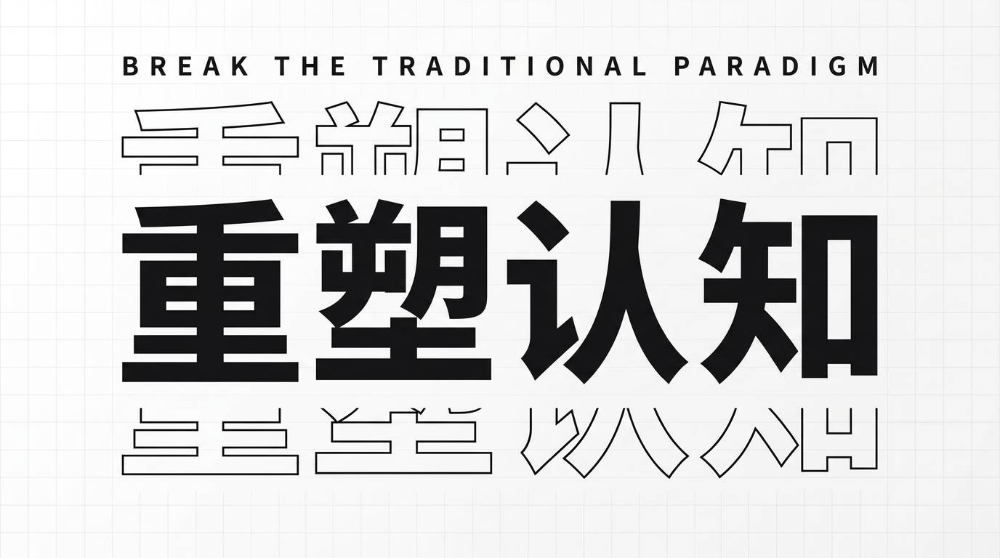
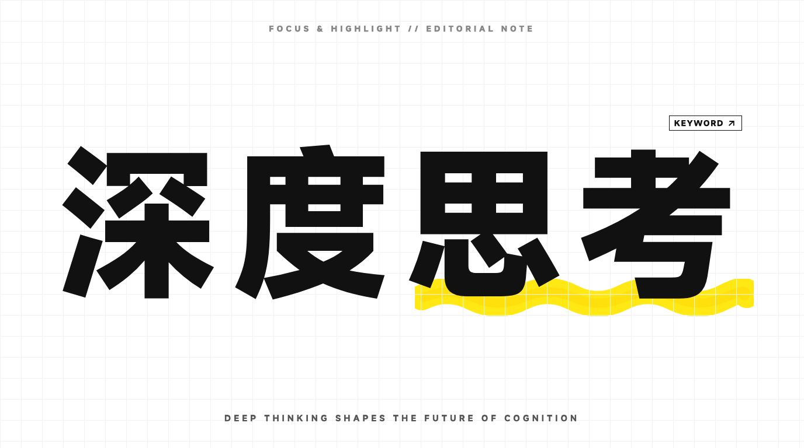
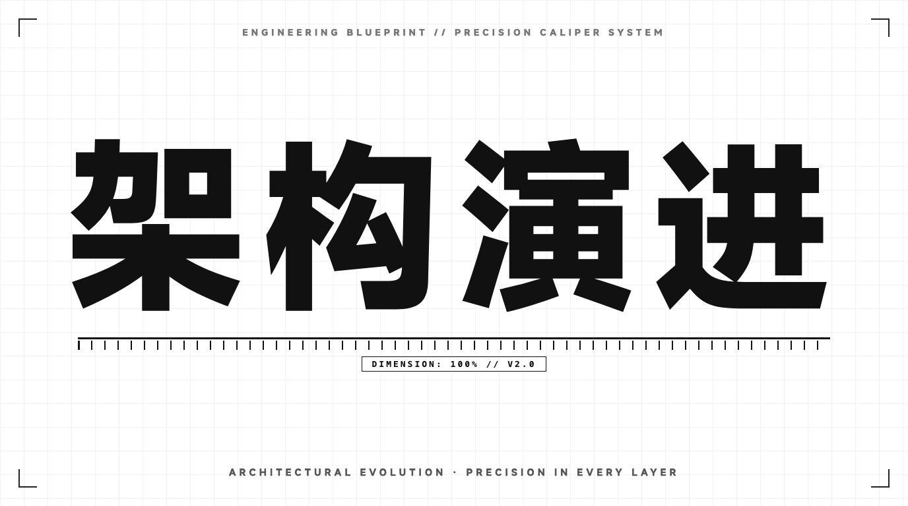

# 🎨 Typography Cover Designer (文字排版设计感封面设计器)

<p align="center">
  <b>专为 X (Twitter) Articles 长文封面（5:2 黄金比例）、推文配图及极客技术海报打造的文字排版设计感生成助手。</b><br>
  提炼自顶级 UI/视觉设计师「蓝胖丨新像素UI设计」的 9 大高阶排版技巧，告别千篇一律的 AI 配图，让纯文字爆发视觉张力。
</p>

<p align="center">
  
  
  
  
</p>

---

## 🌟 视觉出片效果一览 (3×3 Showcase Gallery)

> 以下所有效果图均通过 **Typography Cover Designer Skill** 搭配生图模型（支持 Imagen 3 / FLUX / Midjourney）基于真实设计案例参考图生成，完美遵循网格系统、留白呼吸感与视觉重心平衡。本地可直接打开 [`showcase.html`](showcase.html) 全屏预览与截图。

| 风格 01 · 色块聚焦堆叠风 | 风格 02 · 灵动曲线穿插风 | 风格 03 · 刚柔双字碰撞风 |
| :---: | :---: | :---: |
|  |  |  |
| **《认知跃迁》**<br>纯平面正圆贴纸（无光晕）· 汉字左右微破框张力 · 缝隙微缩英文 | **《向内生长》**<br>单行粗黑大字 · 亮绿平滑圆头曲线前后穿插 · 天地副标呼应 | **《极客构建》**<br>4字单行居中/多字错落自适应 · 红色草书垂直水平居中穿插 · 重心绝对平衡 |
| **风格 04 · 虚实线框衬底风** | **风格 05 · 东方呼吸竖排风** | **风格 06 · 赛博机能波点风** |
|  |  |  |
| **《未来已来》**<br>居中极粗大黑字 · 后景浅绿镂空英文贯穿全屏边缘 · 极强景深张力 | **《大道至简》**<br>横向等宽大拉开间距 · 右上肩拼音绝对水平基线平齐 · 极简日系禅意 | **《探索极限》**<br>半色调波点渐变 · 荧光绿3D硬阴影 · 底部斜切黑色胶囊标语条 |
| **风格 07 · 故障切片抽离风** | **风格 08 · 荧光马克划线风** | **风格 09 · 工程图纸刻度风** |
|  |  |  |
| **《重塑认知》**<br>100% 完整实心主字（无横切断裂）· 上下浅线框向外动态抽离残影 | **《深度思考》**<br>粗黑单行大字 · 亮黄荧光笔迹划线聚焦（双模式自适应：默认局部关键词高亮） | **《架构演进》**<br>四角 L 型十字对齐标 · 精密游标微刻度标尺与尺寸数据胶囊 |

---

## 🎯 核心设计原则与优势

1. **文字即超级符号 (Typography as Hero)**：
   - 彻底摒弃杂乱写实的廉价 AI 插画，回归国际主义瑞士平面排版（Swiss Graphic Design）与极简日系杂志设计哲学。
2. **字数自适应排版矩阵 (Dynamic Word-Count Adaptation)**：
   - **4 汉字**：自动采用单行水平居中 + 贯穿式手写体交叠，坚决杜绝 2+2 等长分行导致的“左重右轻”重心失衡；
   - **5~6 汉字**：自动采用 2+4 阶梯错落左对齐，并用紧凑英文块填补右上角负空间，达成动态杠杆平衡；
   - **2~3 汉字**：超大字号居中加大字间距，外围辅助色块或线框大比例环绕；
   - **荧光划线自适应**：默认为 4 字标题做后两字关键词高亮，若为短词或特定强调则启用全词通栏贯穿。
3. **真实案例图引导 (Reference-Guided Generation)**：
   - 内置裁剪去除水印与字幕的 1620×780 / 1376×768 高清案例图（位于 `assets/examples/`），作为生图参考图（Image-to-Image / Reference Mode）传入，确保构图、线条穿插层次与字体质感高度保真。
4. **适配主流平台画幅**：
   - 默认适配 X (Twitter) Articles 封面标准 **`--ar 5:2`**（2500×1000）；
   - 推文单图配图支持 **`--ar 16:9`**（1920×1080）或 **`--ar 3:2`**；
   - 自动预留四周 15% 安全边距，杜绝移动端头像与圆角裁切。

---

## 📚 9 大排版设计技巧速查表

| 代号 | 风格名称 | 原片口诀 / 概念 | 核心视觉手法 | 适用场景 |
| :---: | :--- | :--- | :--- | :--- |
| **01** | **色块聚焦堆叠风** | 大字标题 上下排列<br>小字英文 色块装饰 | 纯平面正圆贴纸 + 双行大字微破框 + 接缝微缩英文 | 认知颠覆、态度宣言、防坑避坑 |
| **02** | **灵动曲线穿插风** | 大字标题 小字辅助<br>英文点缀 线条穿插 | 单行大黑字 + 亮绿圆头手绘流线在笔画间前后穿梭 | 持续成长、进阶跃迁、AI 工作流 |
| **03** | **刚柔双字碰撞风** | 大字标题 英文装饰<br>倾斜排列 手写字体 | 粗黑体 + 鲜红飘逸连笔手写英文草书刚柔交叠（4字居中/错落自适应） | 独立开发手记、审美随笔、灵感手记 |
| **04** | **虚实线框衬底风** | 大字标题 小字辅助<br>英文点缀 线条描边 | 居中实心大字 + 贯穿全屏的超大镂空描边英文字 | 时代浪潮、重磅发布、宏大视野 |
| **05** | **东方呼吸竖排风** | 大字标题 间距分布<br>小字拼音 竖向排列 | 横向等宽大幅留白 + 右上肩微缩拼音水平基线平齐 | 底层架构、哲学思考、代码美学深度文 |
| **06** | **赛博机能波点风** | 大字标题 小字辅助<br>添加色块 元素点缀 | 半色调波点渐变 + 荧光绿3D硬投影 + 斜切黑色胶囊标语条 | 极客编程实战、黑客挑战、硬核工具 |
| **07** | **故障切片抽离风** | 大字标题 线条描边<br>文字切割 英文装饰 | 完整实心主字 + 上下浅高度描边切片向外动态抽离 | 颠覆创新、前沿实验、先锋潮牌 |
| **08** | **荧光马克划线风** | 沉浸划线 重点高亮<br>笔记美学 灵动提炼 | 粗黑大字 + 鲜亮马克黄倾斜笔迹划线 + 右上微标（双模式自适应） | 深度思考、核心提炼、读书心得、方法论 |
| **09** | **工程图纸刻度风** | 蓝图刻度 四角角标<br>精密标尺 极客工程 | 四角 L 型十字对齐标 + 居中大字 + 精密游标刻度标尺与尺寸胶囊 | 底层工程、系统架构、性能调优、硬核基建 |

---

## 🚀 安装与使用指南

### 作为 Agent Skill 安装 (Claude Code / OpenDesign / Antigravity / Cursor)

克隆本仓库到你的本地 Skills 目录：

```bash
git clone https://github.com/fxzer/typography-cover-designer.git
```

然后在你的 Agent 配置中引入或建立软链接：

```bash
ln -s /path/to/typography-cover-designer ~/.agents/skills/typography-cover-designer
```

#### 对话触发示例：
* *“用文字排版风格，为我的文章《认知跃迁：超级个体的进化之路》设计一张 X 封面”*
* *“用技巧 08 荧光马克划线风，给《深度思考》出图”*
* *“用技巧 09 工程图纸刻度风，给《架构演进》出图”*
* *“用 07 故障切片风生一张推文配图，标题是《重塑认知》”*

---

## 📁 目录结构

```text
typography-cover-designer/
├── README.md                      # 项目说明文档与 3×3 九宫格画廊展示
├── showcase.html                  # 3×3 响应式画廊展示页 (支持全屏高清截图)
├── SKILL.md                       # Agent Skill 规范定义与工作流清单
├── assets/
│   ├── examples/                  # 高清参考截图 (01~09.jpg，去字幕去水印)
│   └── showcase/                  # 官方测试出片成果图 (01~09.jpg，3×3画廊源)
└── references/
    ├── index.md                   # 9 种风格路由逻辑与原片 ASR 口诀映射表
    ├── prompt-templates.md        # 完整中英双语 Prompt 提示词装配库 (含 03/08 双模式与 09 模板)
    └── layout-rules.md            # 排版网格、画幅比例、字数自适应矩阵与负面提示词
```

---

## 📄 License

[MIT License](LICENSE) © 2026 fxzer
