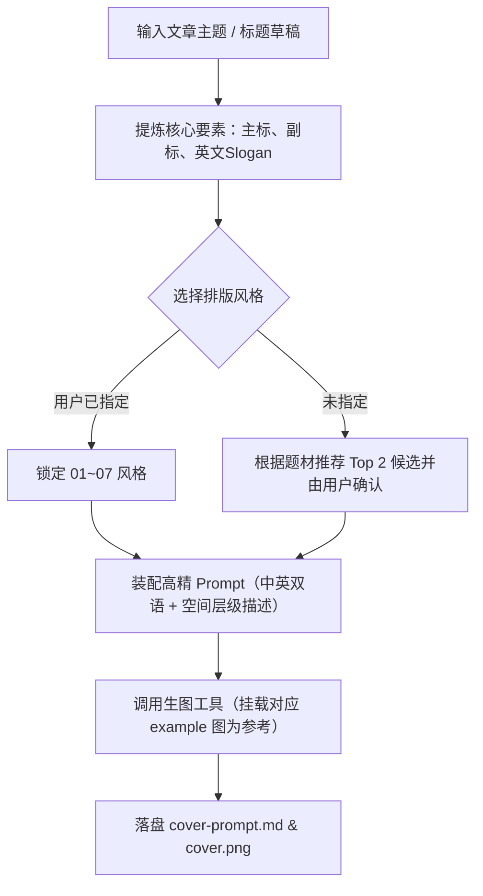

# Typography Cover Designer (文字排版设计感封面设计器)

专为 X (Twitter) Articles 长文封面（**5:2 黄金比例**）与技术推文配图打造的**文字排版设计感生成助手**。

本 Skill 提炼自顶级 UI/视觉设计师「蓝胖丨新像素UI设计」的排版精髓，将平淡无奇的纯文字标题，通过**层级对比、多维破框、几何聚焦、前后虚实与动效切片**等 7 大高阶设计技巧，转化为极具张力与现代艺术美感的视觉大片。

同时深度整合 AI 生图工作流，支持直接将对应技巧的**原片高清截图作为视觉参考图（Reference Image）**，注入专属提示词，一键完成 X 封面生图与确定性落盘。

---

## 🎯 核心原则

1. **文字即视觉主体 (Typography as Hero)**：
   摆脱烂大街的“AI 插画配大字”的割裂模式，将汉字字形、笔画结构、留白与排版细节本身作为封面的超级符号。
2. **两阶段按需渐进加载 (节省 Token)**：
   - 第一阶段仅需查看轻量的 `references/index.md` 进行风格匹配；
   - 第二阶段仅读取对应风格的具体模板与参数规则。
3. **真实案例图辅助参考 (Reference-Guided Generation)**：
   本 Skill 内置了视频中 7 大技巧去除字幕与水印后的纯净 1620×780 高清案例图（存档于 `assets/examples/01~07.jpg`），在调用生图工具（如 `generate_image`）时可直接作为 `ImagePaths` 传入，提供强有力的构图与视觉引导。
4. **严格 5:2 / 16:9 画幅与安全边距**：
   所有生成的构图与参数一律适配 X 封面黄金比例 `--ar 5:2`（推文配图 `--ar 16:9`），预留四周安全区，避免被移动端圆角或头像裁切。
5. **确定性落盘**：
   设计方案与提示词存入当前文章的 `assets/cover-prompt.md`，图片输出为 `assets/cover.png`，完美衔接 `yichen-x-article-draft-uploader`。

---

## 🎨 7 大核心文字排版风格库

| 代号 | 风格名称 | 原片 ASR 实操口诀 | 核心视觉手法与配色 | 对应参考图 |
| :--- | :--- | :--- | :--- | :--- |
| **`01`** | **色块聚焦堆叠风** | 大字标题 上下排列 小字英文 色块装饰 | 紧凑双行大字居中 + 缝隙嵌入微缩英文 + 背后荧光浅绿正圆光晕 | `assets/examples/01-color-block-stack.jpg` |
| **`02`** | **灵动曲线穿插风** | 大字标题 小字辅助 英文点缀 线条穿插 | 单行大字居中 + 天地副标题 + 亮绿手绘流线穿插汉字笔画内外 | `assets/examples/02-line-weave.jpg` |
| **`03`** | **刚柔双字碰撞风** | 大字标题 英文装饰 倾斜排列 手写字体 | 倾斜错落粗黑大字 + 右上小英文 + 背后叠印鲜红飘逸手写花体草书 | `assets/examples/03-script-clash.jpg` |
| **`04`** | **虚实线框衬底风** | 大字标题 小字辅助 英文点缀 线条描边 | 居中实心大字 + 底部宽距副标 + 后景贯穿全屏的超大浅绿镂空描边英文字 | `assets/examples/04-outline-underlay.jpg` |
| **`05`** | **东方呼吸竖排风** | 大字标题 间距分布 小字拼音 竖向排列 | 横排大字等宽拉大留白 + 右侧负空间垂直竖排精致拼音/微缩英文 | `assets/examples/05-vertical-inset.jpg` |
| **`06`** | **赛博机能波点风** | 大字标题 小字辅助 添加色块 元素点缀 | 大字波点网点渐变 + 荧光绿3D硬阴影 + 斜切黑色胶囊标语条 | `assets/examples/06-halftone-3d-badge.jpg` |
| **`07`** | **故障切片抽离风** | 大字标题 线条描边 文字切割 英文装饰 | 完整实心黑体大字（无切断） + 上下紧凑低高度描边切片向外抽离 + 顶部超宽小英文 | `assets/examples/07-glitch-slice.jpg` |

---

## 🔄 执行工作流 (Workflow)

### Step 1: 解析文章与文案提炼

根据用户给出的文章内容、标题或核心需求，提炼以下 4 大排版要素：
1. **中文主标题（`MAIN_TITLE`）**：4~8 汉字（短小有力、富有视觉张力）；
2. **中文副标题（`SUB_TITLE`）**：8~16 汉字（痛点、解药、关键结论）；
3. **英文口号/装饰词（`ENGLISH_SLOGAN`）**：大写英文短语（增添现代国际感与呼吸感）；
4. **特定风格扩展词与排版约束（字数自适应与重心平衡）**：
   - **风格 03 字数自适应策略（严禁呆滞的 2+2 等长两行）**：
     - **4 汉字标题（如《极客构建》）**：必须使用**模式 03-A（单行居中版）**，4 字保持单行水平排列完全居中，红色手写草书居中贯穿汉字中心（垂直水平居中），英文口号置于正上方居中，重心极度稳固平衡；
     - **5~6 汉字标题（如《极客 奔赴未来》）**：使用**模式 03-B（非对称错落版）**，严格遵循 2+4 结构，统一向左对齐并前倾斜体，右上角负空间用小英文块补齐，红色花体草书横跨两行缝隙；
   - **风格 04 扩展词**：需要超大镂空背景词（`MASSIVE_BG_WORD`，如 "AGENT", "FUTURE", "SCALE"）；
   - **风格 06 扩展词**：需要斜切胶囊标语（`SLOGAN_BANNER`，如 "无畏前行 永探新境"）。

---

### Step 2: 风格匹配与确认

1. **用户已指定风格编号或名称**：直接锁定对应模板与参考图。
2. **用户未指定风格**：
   - 快速查看 `references/index.md`；
   - 根据文章题材匹配 **Top 2 最契合的风格**，向用户给出 1 句话推荐理由供选择。

---

### Step 3: 装配精准生图 Prompt

读取 `references/prompt-templates.md` 中对应风格的标准化英文描述：
1. 替换 `{MAIN_TITLE}` 等占位符；
2. 保持对 **网格背景（subtle graph paper grid）**、**纯净留白（minimalist negative space）**、**字体材质与光影** 的精准约束；
3. 追加适配画幅参数（`--ar 5:2` 用于 X Articles 封面，`--ar 16:9` 用于推文大图）。

---

### Step 4: 生图执行与文件落盘

1. **直接调用生图工具**：
   - 使用内置 `generate_image` 工具；
   - **重点**：将对应风格的高清案例图路径 `assets/examples/0X-*.jpg` 作为 `ImagePaths` 传入，作为视觉结构参考！
   - 设置 `AspectRatio: "16:9"` 或相应画幅。
2. **落盘保存**：
   - 将生成的图片落盘至当前文章目录的 `assets/cover.png`（若在独立工作区，落盘至指定的输出路径）；
   - 将完整的装配提示词与 Midjourney / FLUX 格式即拷提示词保存至 `assets/cover-prompt.md`。
3. **展示交付**：
   - 向用户清晰展示生成的封面效果；
   - 附带即拷即用的 Midjourney / FLUX Web 端提示词。
